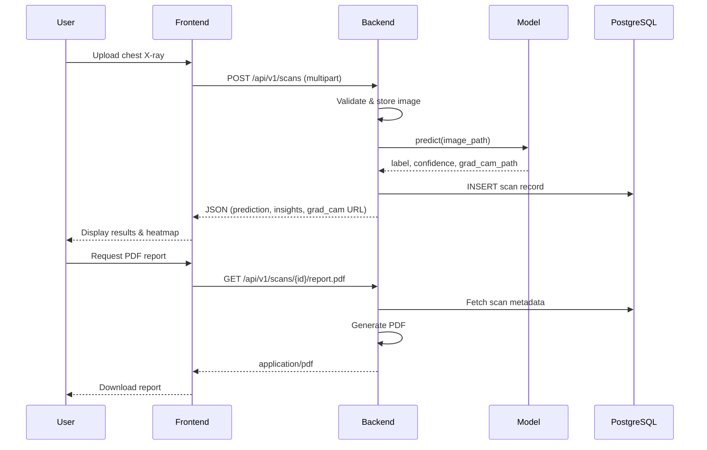

# CareVision AI — System Architecture

This document describes the high-level architecture of **CareVision AI**, a deep learning–based chest X-ray analysis system for pneumonia detection with explainable AI, scan history, and PDF reporting.

---

## Overview

CareVision AI is organized as a **modular monorepo** with clear separation between data, model training, inference, API services, and the user interface.

```
┌─────────────────────────────────────────────────────────────────────────────┐
│                              CareVision AI                                  │
├──────────────┬──────────────┬──────────────┬──────────────┬─────────────────┤
│   dataset/   │   backend/   │  frontend/   │     docs/                    │
│  Data assets │ Train & infer│  REST API    │  Web UI      │  Documentation  │
└──────────────┴──────────────┴──────────────┴──────────────┴─────────────────┘
```

| Directory   | Responsibility |
|------------|----------------|
| `dataset/` | Raw and processed chest X-ray images, splits, and data-pipeline artifacts |
| `backend/` | HTTP API, authentication, persistence, file uploads, inference orchestration, PDF generation |
| `backend/model/` | Training scripts, saved weights, evaluation, and inference utilities (including Grad-CAM) |
| `frontend/`| Web application for upload, results, explanations, history, and reports |
| `docs/`    | Architecture, development, and operational documentation |

---

## Logical Architecture

```
                    ┌──────────────────┐
                    │     Clinician    │
                    │   / Researcher   │
                    └────────┬─────────┘
                             │ HTTPS
                             ▼
                    ┌──────────────────┐
                    │    frontend/     │
                    │  (Web Client)    │
                    └────────┬─────────┘
                             │ REST / JSON
                             ▼
                    ┌──────────────────┐
                    │    backend/      │
                    │   (API Server)   │
                    └───┬──────────┬───┘
                        │          │
           ┌────────────┘          └────────────┐
           ▼                                    ▼
  ┌─────────────────┐                 ┌─────────────────┐
  │   PostgreSQL    │                 │     model/      │
  │  (scan history, │                 │  (TensorFlow    │
  │   users, meta)  │                 │   inference +   │
  └─────────────────┘                 │    Grad-CAM)    │
                                      └────────┬────────┘
                                               │
                                               ▼
                                      ┌─────────────────┐
                                      │   dataset/      │
                                      │ (training data) │
                                      └─────────────────┘
```

---

## Core Components

### 1. Frontend (`frontend/`)

The web client provides the primary user experience:

- **Image upload** — Chest X-ray submission with validation (format, size).
- **Analysis dashboard** — Prediction label, confidence score, and AI-assisted diagnostic insights.
- **Explainability** — Grad-CAM heatmap overlay on the source image.
- **Scan history** — Paginated list of past analyses with filters and detail views.
- **PDF reports** — Download or view generated diagnostic summaries.

The frontend communicates with the backend over a versioned REST API (e.g. `/api/v1`). Environment-specific API base URLs are configured via root `.env` (see `.env.example`).

### 2. Backend (`backend/`)

The API layer orchestrates business logic and integrates subsystems:

| Concern | Description |
|--------|-------------|
| **Authentication & authorization** | Session or JWT-based access to protected routes (scan history, reports). |
| **Upload handling** | Secure storage of incoming X-rays; path references stored in the database. |
| **Inference pipeline** | Loads the trained model from `model/`, preprocesses images, runs prediction. |
| **Grad-CAM generation** | Invokes model explainability utilities; returns overlay image or coordinates for the UI. |
| **Persistence** | PostgreSQL for users, scans, predictions, metadata, and report references. |
| **PDF generation** | Builds reports from scan results, confidence, insights, and optional Grad-CAM thumbnail. |

Typical request flow for a new scan:

1. Client uploads image → backend validates and stores file.
2. Backend calls model inference → receives class probabilities and optional Grad-CAM artifact.
3. Backend persists scan record and returns structured JSON to the client.
4. Client renders results; user may trigger PDF generation via a dedicated endpoint.

### 3. Model (`model/`)

The machine learning subsystem is responsible for:

- **Data loading** — Reading preprocessed splits from `dataset/` (or paths configured at train time).
- **Training** — CNN-based (or transfer-learning) classifier for pneumonia vs. normal (extensible to multi-class).
- **Evaluation** — Metrics such as accuracy, precision, recall, F1, and confusion matrix.
- **Inference API** — Functions callable by the backend: `predict(image)`, `explain(image)` for Grad-CAM.
- **Artifact management** — Versioned weights under `backend/model/` (gitignored; documented in setup guides).

Grad-CAM highlights regions that most influenced the model’s decision, supporting clinical transparency. Layer selection may be configured via environment variables (see `.env.example`).

### 4. Dataset (`dataset/`)

Data is kept out of version control (see root `.gitignore`). Expected layout:

```
dataset/
├── raw/           # Original chest X-ray images (not committed)
├── processed/     # Resized, normalized, or augmented sets
└── splits/        # train / val / test index files or folder structure
```

The training pipeline in `model/` should document expected directory structure and labeling convention (e.g. folder-per-class or CSV manifest).

### 5. Documentation (`docs/`)

- **ARCHITECTURE.md** (this file) — System design and data flows.
- **DEVELOPMENT.md** — Local setup, tooling, and workflows.

---

## Data Flow: End-to-End Analysis



---

## Technology Stack (Planned)

| Layer | Technology |
|-------|------------|
| Deep learning | TensorFlow / Keras |
| Backend | Python (e.g. FastAPI or Flask) |
| Database | PostgreSQL |
| Frontend | Node.js (e.g. React with Vite) |
| Explainability | Grad-CAM |
| Reports | PDF library (e.g. ReportLab, WeasyPrint, or equivalent) |

Exact package choices will be finalized when application code is added under each directory.

---

## Security Considerations

- **Secrets** — All credentials live in `.env`; never commit real values.
- **Uploads** — Enforce type, size, and optional malware scanning; store outside web root.
- **API** — Rate limiting, authentication on history and report endpoints.
- **PHI / HIPAA** — If deployed with real patient data, additional compliance controls (encryption at rest, audit logs, BAA with cloud providers) are required. Default documentation assumes **research or demo** use with de-identified public datasets.

---

## Deployment Topology (Reference)

For production, a common pattern is:

- **Frontend** — Static build served via CDN or reverse proxy (Nginx).
- **Backend** — Containerized API behind load balancer.
- **PostgreSQL** — Managed service or dedicated instance.
- **Model weights** — Mounted volume or object storage; loaded at API startup or on first request.

Horizontal scaling of the API is feasible if inference is stateless and the model is loaded per worker or via a dedicated inference microservice.

---

## Extension Points

- Multi-label or multi-pathology classification beyond pneumonia.
- DICOM ingest and PACS integration.
- Active learning loop feeding misclassified cases back to `dataset/`.
- Model versioning and A/B testing via feature flags in the backend.
- Real-time collaboration or radiologist review queues.

---

## Related Documents

- [Local Development Setup](./DEVELOPMENT.md)
- [Project README](../README.md)
